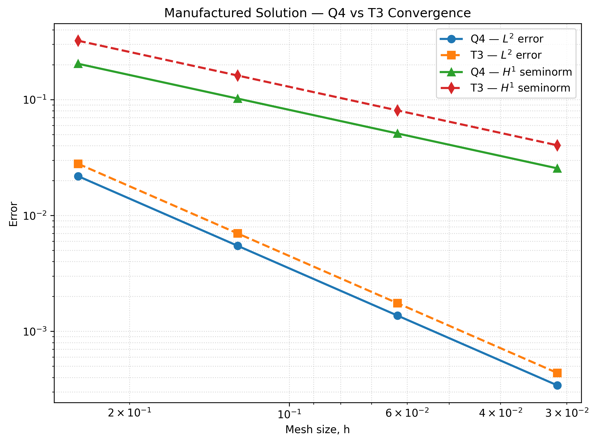
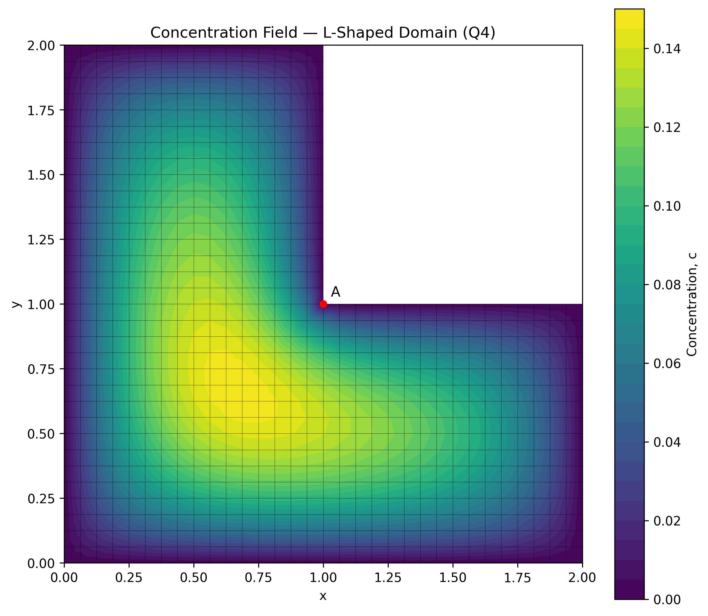
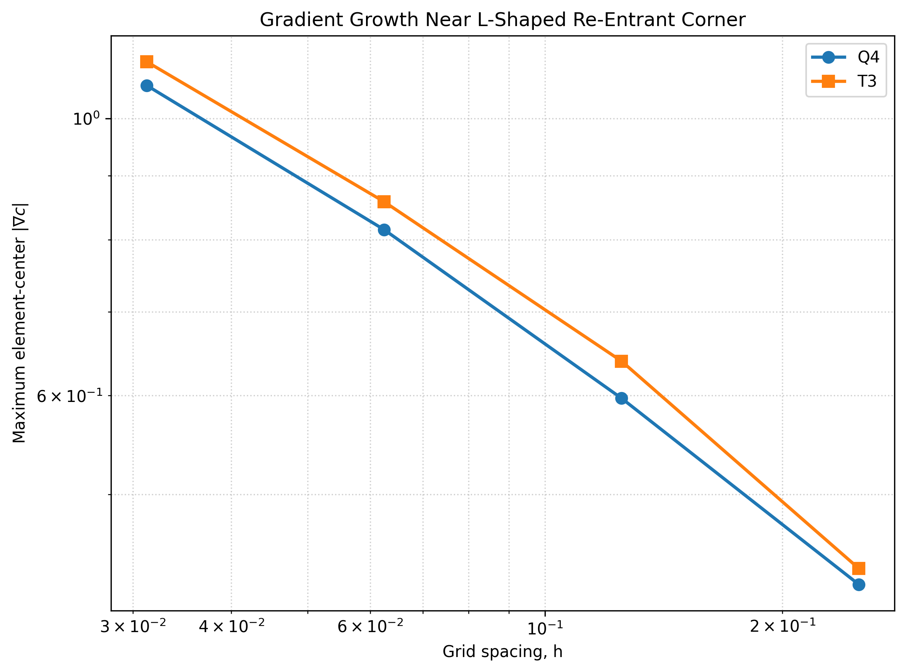
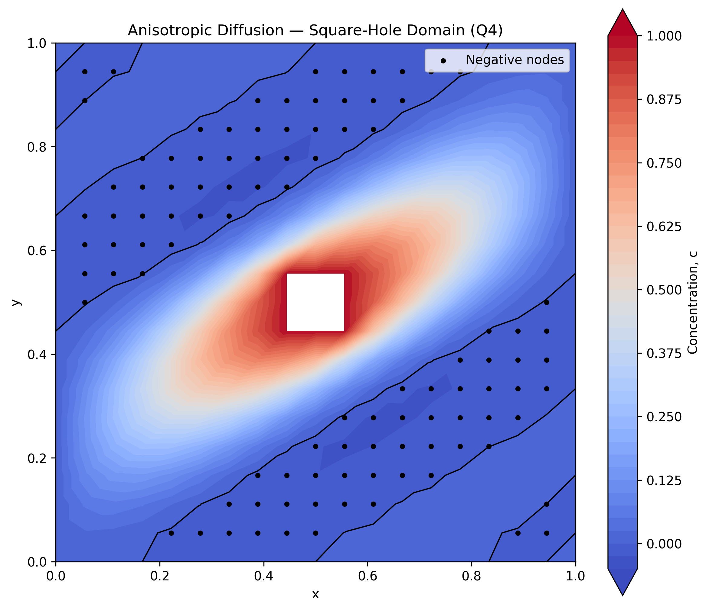
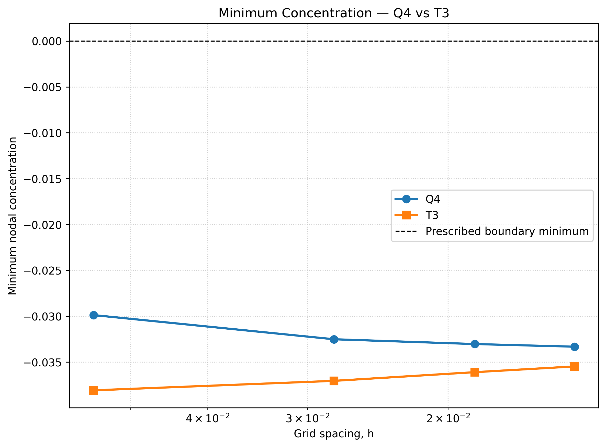
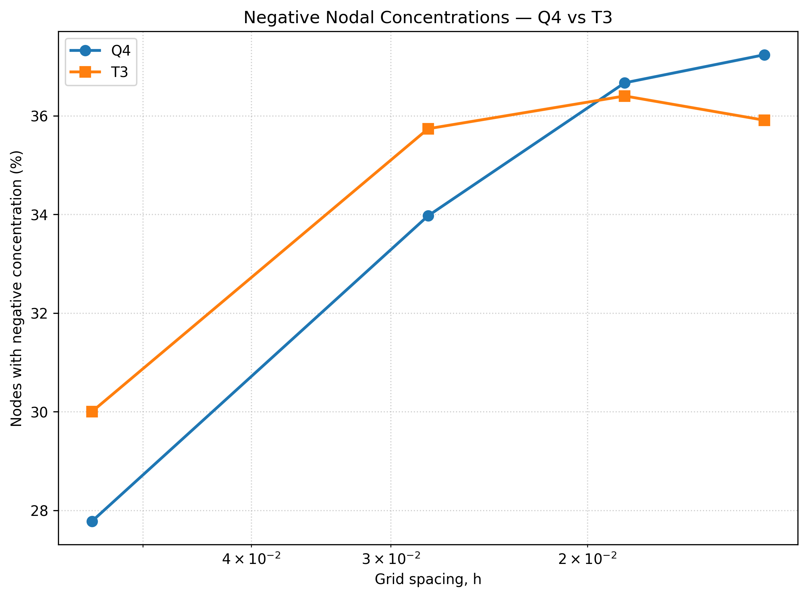

# Finite Element Solver for Steady-State Diffusion

**Author:** Ihina Mahajan

A modular finite element method (FEM) solver written in Python for two-dimensional steady-state diffusion problems.

The solver supports four-node quadrilateral (Q4) and three-node triangular (T3) elements and includes analytical verification, mesh-refinement studies, isotropic and anisotropic diffusion, and benchmark problems with nontrivial numerical behavior.

---

## Installation

Clone the repository:

```bash
git clone https://github.com/ihina17/fem-diffusion-solver.git
cd fem-diffusion-solver
```

Create a virtual environment:

```bash
python -m venv .venv
```

Activate the environment.

**Windows PowerShell**

```powershell
.\.venv\Scripts\Activate.ps1
```

**macOS / Linux**

```bash
source .venv/bin/activate
```

Install the required dependencies:

```bash
python -m pip install -r requirements.txt
```

Main dependencies:

- NumPy
- SciPy
- Matplotlib

---

## Project Structure

```text
fem-diffusion-solver/
│
├── src/
│   ├── fem/
│   │   ├── create_id.py
│   │   ├── gauss_quadrature.py
│   │   └── shape_functions.py
│   │
│   ├── meshes/
│   │   ├── Q4.py
│   │   └── T3.py
│   │
│   ├── physics_models/
│   │   ├── diffusion_driver.py
│   │   └── diffusion_kernel.py
│   │
│   └── error_calculation.py
│
├── problems/
│   ├── diffusion_convergence.py
│   ├── l_shaped_domain.py
│   └── square_hole_domain.py
│
├── tests/
│   └── test_error_calculation.py
│
├── figures/
│
├── requirements.txt
├── .gitignore
└── README.md
```

The repository is organized into the following components:

- `src/fem/` — reusable finite element routines for shape functions, Gaussian quadrature, and global equation numbering.
- `src/meshes/` — mesh-generation utilities for Q4 and T3 elements.
- `src/physics_models/` — steady-state diffusion driver, element calculations, and global assembly.
- `src/error_calculation.py` — L2 and H1 error calculations for analytical verification.
- `problems/` — numerical verification and benchmark problems.
- `tests/` — automated numerical tests.
- `figures/` — generated concentration fields, mesh-refinement studies, and comparison plots.

---

## Features

- Q4 quadrilateral and T3 triangular finite elements
- Shape functions and Gaussian quadrature
- Global finite element assembly
- Dirichlet boundary conditions
- Isotropic and anisotropic diffusion
- Analytical error calculation
- L2 and H1 convergence analysis
- Mesh-refinement studies
- Concentration and gradient visualization

---

## Numerical Verification

The FEM implementation is verified using a manufactured analytical solution on the unit square.

Both Q4 and T3 formulations are tested using a sequence of uniformly refined meshes.

The observed convergence rates are:

| Element | L2 Rate | H1 Rate |
|---|---:|---:|
| Q4 | 2.0000 | 1.0000 |
| T3 | 2.0000 | 1.0000 |

Both formulations recover the expected second-order convergence in the L2 norm and first-order convergence in the H1 seminorm.



**Figure 1.** Convergence of the Q4 and T3 finite element formulations under uniform mesh refinement.

---

## L-Shaped Domain

The first benchmark considers steady-state diffusion on an L-shaped domain with homogeneous Dirichlet boundary conditions.

The geometry contains a re-entrant corner, resulting in singular behavior of the concentration gradient. Both Q4 and T3 elements are used to investigate the numerical solution under mesh refinement.

### Concentration Field



**Figure 2.** Concentration field on the L-shaped domain using Q4 elements.

### Gradient Refinement



**Figure 3.** Maximum sampled concentration-gradient magnitude for Q4 and T3 elements under mesh refinement.

The maximum sampled gradient increases as the mesh is refined, consistent with singular behavior near the re-entrant corner.

Additional Q4 and T3 concentration and gradient plots are available in the `figures/` directory.

---

## Strongly Anisotropic Diffusion

The second benchmark considers a square domain containing a square hole with strongly directional anisotropic diffusion.

The inner boundary is prescribed a concentration of 1, while the outer boundary is prescribed a concentration of 0.

Both Q4 and T3 discretizations produce an elongated concentration field along the preferred diffusion direction.

### Concentration Field



**Figure 4.** Q4 concentration field for the strongly anisotropic square-hole problem. Black markers indicate nodes with negative computed concentrations.

### Mesh-Refinement Comparison



**Figure 5.** Minimum nodal concentration for Q4 and T3 elements under mesh refinement.

The standard Galerkin solutions exhibit negative nodal concentrations for both element formulations. The numerical undershoot persists over the tested mesh resolutions.



**Figure 6.** Percentage of nodes with negative concentration for Q4 and T3 discretizations.

Additional mesh, concentration, and refinement plots are available in the `figures/` directory.

---

## Tests

The repository includes automated numerical tests for the error-calculation routines.

Current test suite:

```text
29 tests passed
```

Tests can be executed using:

```bash
python -m pytest -q
```

---

## Scope

The current implementation focuses on two-dimensional steady-state diffusion with prescribed Dirichlet boundary conditions.

Possible future extensions include:

- higher-order finite elements
- adaptive mesh refinement
- transient diffusion
- mixed boundary conditions
- positivity-preserving formulations