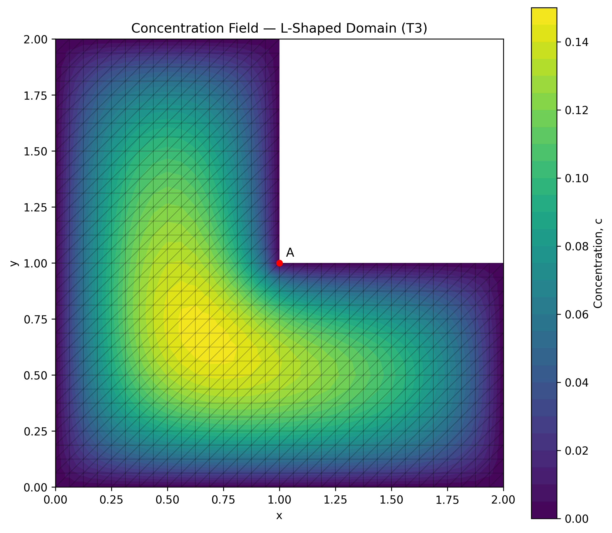
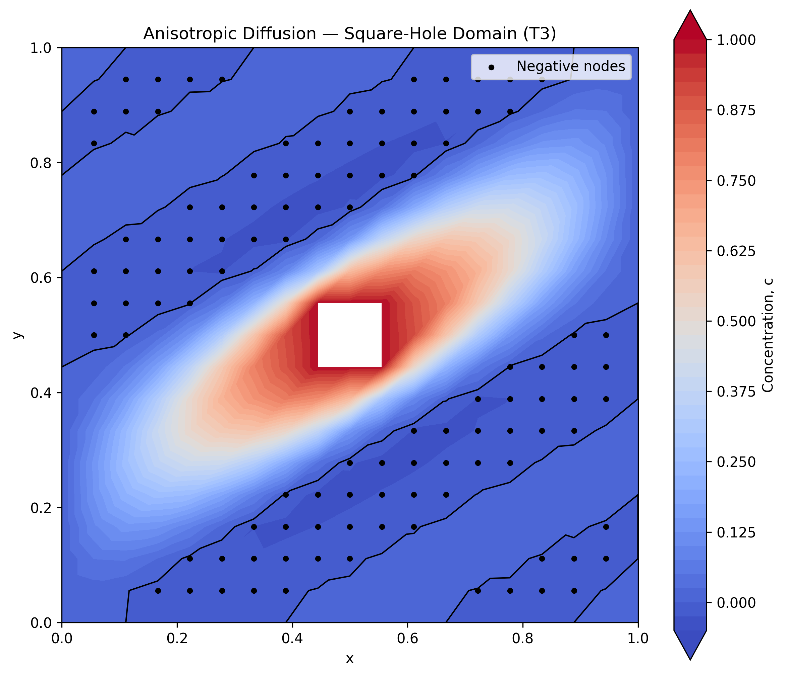

# Finite Element Solver for Steady-State Diffusion

*Author: Ihina Mahajan*

A Python implementation of the finite element method (FEM) for two-dimensional steady-state diffusion problems using four-node quadrilateral (Q4) and three-node triangular (T3) elements.

The repository includes a modular FEM implementation, verification against a manufactured solution, and numerical studies of diffusion in an L-shaped domain and a square domain containing a square hole.

## Installation

Clone the repository and move into the project directory:

```bash
git clone https://github.com/ihina17/fem-diffusion-solver.git
cd fem-diffusion-solver
```

Create a Python virtual environment:

```bash
python -m venv .venv
```

Activate it on **Windows PowerShell**:

```powershell
.\.venv\Scripts\Activate.ps1
```

Or on **macOS/Linux**:

```bash
source .venv/bin/activate
```

Install the dependencies:

```bash
python -m pip install -r requirements.txt
```

The primary dependencies are NumPy, SciPy, and Matplotlib.

## Running the examples

Run each example from the **project root directory**.

**Manufactured-solution convergence study (Q4 and T3):**

```bash
python -m problems.diffusion_convergence
```

**Diffusion on an L-shaped domain (Q4 and T3):**

```bash
python -m problems.l_shaped_domain
```

**Anisotropic diffusion on a square-hole domain (Q4 and T3):**

```bash
python -m problems.square_hole_domain
```

The scripts print numerical results and save plots in the `figures/` directory. Mesh resolution and element type can also be selected programmatically. For example:

```python
from problems.square_hole_domain import solve_square_hole_problem

Coord, Connectivity, U = solve_square_hole_problem(
    n=18,
    element_type="T3",
)
```

Run the automated tests with:

```bash
python -m pytest -q
```

## Governing equations and numerical formulation

The solver considers the steady-state diffusion equation

```math
-\nabla\cdot\left(\mathbf{D}\nabla c\right)=f
\qquad\text{in }\Omega,
```

subject to prescribed Dirichlet boundary conditions

```math
c=\bar{c}\qquad\text{on }\Gamma_D.
```

Here, $c$ is the concentration, $\mathbf{D}$ is the diffusion tensor, $f$ is the volumetric source, and $\Gamma_D$ is the prescribed-value boundary.

The finite element approximation is

```math
c_h(\mathbf{x})=\sum_{a=1}^{n_{\mathrm{en}}}N_a(\mathbf{x})c_a,
```

where $N_a$ denotes an element shape function and $c_a$ is a nodal concentration. With the standard Galerkin formulation, the element stiffness matrix and load vector are

```math
\mathbf{K}^{(e)}=\int_{\Omega_e}\mathbf{B}^{T}\mathbf{D}\mathbf{B}\,d\Omega,
```

```math
\mathbf{F}^{(e)}=\int_{\Omega_e}\mathbf{N}^{T}f\,d\Omega.
```

The code includes shape functions, Gaussian quadrature, element-level calculations, global assembly, enforcement of Dirichlet boundary conditions, and solution of the resulting linear system.

| Element type | Nodes per element | Quadrature used for assembly in the examples |
|---|---:|---|
| Q4 | 4 | $2\times2$ Gauss points |
| T3 | 3 | One centroid point |

Higher-order quadrature is used to integrate the squared errors in the analytical verification study.

## Numerical verification: manufactured-solution convergence

The solver is verified on the unit square,

```math
\Omega=[0,1]\times[0,1],
```

using the manufactured solution

```math
c_{\mathrm{exact}}(x,y)=x^2+y^2+xy.
```

For the isotropic diffusivity $\mathbf{D}=\mathbf{I}$, the corresponding volumetric source is $f=-4$. The exact solution is prescribed on the entire boundary.

The errors are evaluated in the $L^2$ norm and $H^1$ seminorm:

```math
\|c-c_h\|_{L^2(\Omega)}
=\left(\int_{\Omega}(c-c_h)^2\,d\Omega\right)^{1/2},
```

```math
|c-c_h|_{H^1(\Omega)}
=\left(\int_{\Omega}\|\nabla c-\nabla c_h\|^2\,d\Omega\right)^{1/2}.
```

Both element formulations recover the expected convergence rates under uniform mesh refinement:

| Element type | $L^2$ convergence rate | $H^1$ convergence rate |
|---|---:|---:|
| Q4 | 2.0000 | 1.0000 |
| T3 | 2.0000 | 1.0000 |

```math
\|c-c_h\|_{L^2}=O(h^2),\qquad
|c-c_h|_{H^1}=O(h).
```


*Figure 1. $L^2$ and $H^1$ error convergence for Q4 and T3 elements. The plot contains numerical error curves without theoretical reference lines.*

## Numerical application 1: L-shaped domain

The first application solves

```math
-\nabla^2 c=1\qquad\text{in }\Omega,
```

with $c=0$ on the entire boundary of an L-shaped domain. The geometry has a re-entrant corner at $(1,1)$, where the solution gradient exhibits singular behavior.

The Q4 and T3 solutions are compared through concentration fields and maximum sampled gradient magnitudes under mesh refinement.




*Figure 2. Concentration fields on the L-shaped domain using Q4 and T3 elements, respectively.*


*Figure 3. Maximum sampled concentration-gradient magnitude under mesh refinement for the two element formulations.*

The computed maximum gradient magnitude increases as the mesh is refined, consistent with the expected re-entrant-corner singularity. The Q4 and T3 gradients are sampled using their respective element representations, so a difference between the maxima is not, by itself, a measure of relative accuracy.

## Numerical application 2: anisotropic diffusion on a square-hole domain

The second application considers a unit square with a square hole. The outer boundary has $c=0$, and the hole boundary has $c=1$. The volumetric source is zero.

The diffusion tensor is

```math
\mathbf{D}=\mathbf{R}(\theta)
\begin{bmatrix}
d_1 & 0\\
0 & d_2
\end{bmatrix}
\mathbf{R}(\theta)^T,
```

with

```math
d_1=10^4,\qquad d_2=0,\qquad\theta=\frac{\pi}{6}.
```

This tensor is positive semidefinite rather than positive definite because one principal diffusivity is zero.




*Figure 4. Q4 and T3 concentration fields. Black markers indicate nodes with negative computed concentrations.*

Both discretizations produce negative nodal concentrations even though the prescribed boundary values are nonnegative. These numerical undershoots persist over the tested mesh refinements.


*Figure 5. Minimum nodal concentration versus structured-grid spacing for Q4 and T3 elements.*


*Figure 6. Percentage of nodes with negative computed concentrations under mesh refinement.*

Because the diffusion operator is degenerate, the usual assumptions for a uniformly elliptic maximum principle do not apply. These figures document the behavior of the specified numerical formulations; they do not establish a general maximum-principle result.

## Project structure

```text
fem-diffusion-solver/
├── src/
│   ├── fem/
│   │   ├── create_id.py
│   │   ├── gauss_quadrature.py
│   │   └── shape_functions.py
│   ├── meshes/
│   │   ├── Q4.py
│   │   └── T3.py
│   ├── physics_models/
│   │   ├── diffusion_driver.py
│   │   └── diffusion_kernel.py
│   └── error_calculation.py
├── problems/
│   ├── diffusion_convergence.py
│   ├── l_shaped_domain.py
│   └── square_hole_domain.py
├── figures/
├── tests/
├── requirements.txt
├── .gitignore
└── README.md
```

## Scope and limitations

The current examples focus on two-dimensional steady-state diffusion with prescribed Dirichlet boundary conditions. Positivity-preserving constraints, adaptive mesh refinement, and time-dependent diffusion are not implemented in this project.
